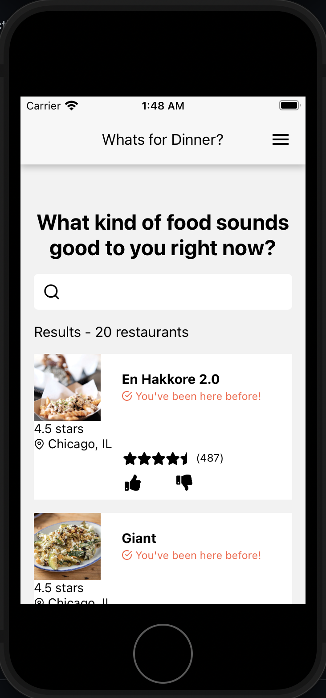
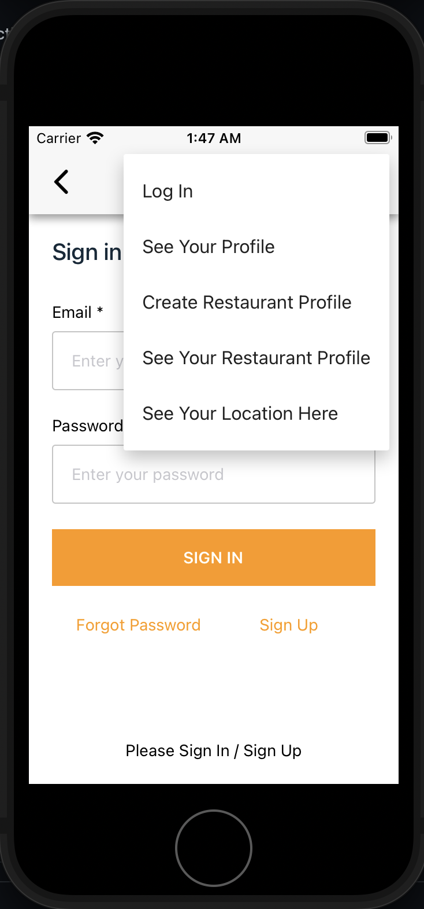
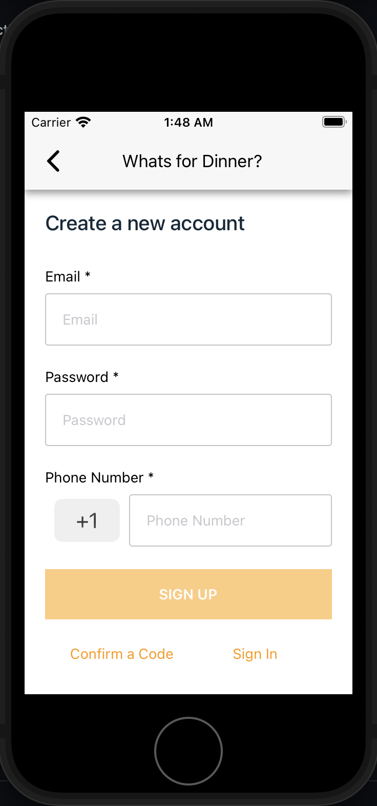

A cross-platform application written in React Native suggesting users restaurants around them that fit their dining preferences. The application uses AWS Amplify for user authentication and Yelp API for restaurants search and display. Credits go to a group of students including me in SE491 class in 2021 at Depaul University.

